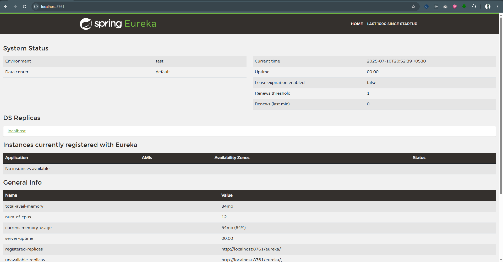
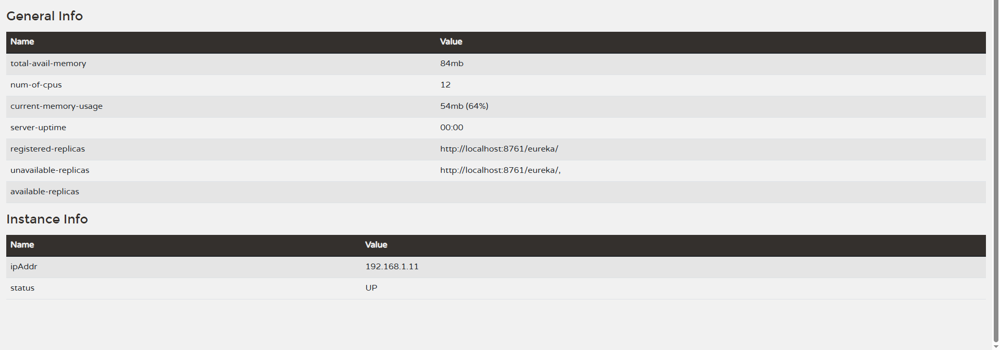

# Java Springboot microservices
## Dependencies Needed:
## Service Registry:
### Notes:
- It is a gateway where all the services are registered.
- Other notes
### Code Part:
- Dependencies needed
  - spring-cloud-starter-netflix-eureka-server
  - spring-boot-starter-web 
  - spring-boot-devtools [if wants]
- In Service Registry's Application.java, add **@EnableEurekaServer**.
  ```
  package com.gomad.service_registry;

  import org.springframework.boot.SpringApplication;
  import org.springframework.boot.autoconfigure.SpringBootApplication;
  import org.springframework.cloud.netflix.eureka.server.EnableEurekaServer;

  @SpringBootApplication
  @EnableEurekaServer
  public class ServiceRegistryApplication {

      public static void main(String[] args) {
          SpringApplication.run(ServiceRegistryApplication.class, args);
      }

  }
  ```
- In application.properties, add the following configuration properties:
    ```
    server.port=8761
    # Not to register with itself.
    eureka.client.register-with-eureka=false
    eureka.client.fetch-registry=false

    # Time (in seconds) after which Eureka considers an instance dead if no heartbeat is received
    eureka.server.lease-expiration-duration-in-seconds=15

    # How often (in seconds) Eureka expects to receive a heartbeat renewal from each client
    eureka.server.lease-renewal-interval-in-seconds=5
    ```
- Run the application and access at **http://localhost:8761/**.
  
  


## Client Registry:
### Notes:
- Client are need to be registered.

### Code Part:
- Dependencies needed
  - spring-cloud-starter-netflix-eureka-client
  - spring-boot-starter-web 
  - spring-boot-devtools [if wants]
  - spring-boot-starter-data-jpa
  - postgresql
  - lombok

- In **application.properties**:
    ```
    # Eureka-Registry Setup
    eureka.client.serviceUrl.defaultZone=http://localhost:8761/eureka/
    eureka.client.register-with-eureka=true
    eureka.client.fetch-registry=true

    eureka.instance.hostname=localhost
    eureka.instance.prefer-ip-address=false
    eureka.instance.instance-id=company_ms:8081

    spring.cloud.compatibility-verifier.enabled=false
    ```
- **Note**
  - Always remember don't mention "_" in **spring.application.name**
    - spring.application.name=company_ms ❌ 
    - spring.application.name=company-ms ✅

